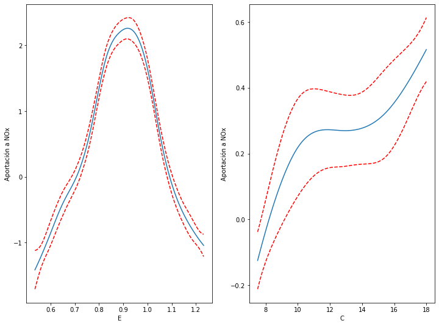
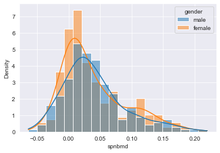
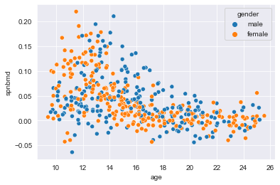
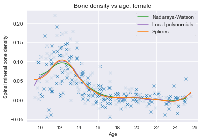
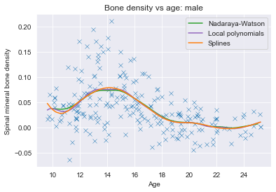

## Pregunta 1.
Construya un núcleo de orden 2 con soporte en $[−1, 1]$ y que sea un polinomio de grado 2.
### Respuesta
Un núcleo debe cumplir con la siguiente identidad: 
$$\int_{-\infty}^{\infty}K(u)du = 1$$
Considerando un polinomio de segundo grado con soporte en $[-1,1]$:
$$\int_{-1}^1 au^2+bu+c\ du= 1\tag{1}$$
Este polinomio debe cumplir con las siguientes restricciones adicionales: 
$$\begin{align}
\int_{-1}^1 u\left(au^2+bu+c\right)du = 0 \\
\int_{-1}^1 u^2\left(au^2+bu+c\right)du = 0 \tag{2}
\end{align}$$
Integrando la ecuación $1$:
$$\begin{align*}
\left.\left(\frac{a}{3}u^3+\frac{b}{2}u^2+cu\right)\right|_{-1}^1 &= 1 \\
\frac{a}{3}(1-(-1))+\frac{b}{2}(1-1)+c(1-(-1)) &= 1 \\
\frac{2a}{3} + 2c &= 1
\end{align*}$$
Integrando las ecuaciones en $2$, para cumplir las restricciones de orden del núcleo: 
$$\begin{align*}
\int_{-1}^1 u\left(au^2+bu+c\right)du &= 0 \\
\left.\left(\frac{a}{4}u^4+\frac{b}{3}u^3+\frac{c}{2}u^2\right)\right|_{-1}^1 &= 0 \\
\frac{a}{4}(1-1)+\frac{b}{3}(1-(-1))+\frac{c}{2}(1-1) &= 0 \\
\frac{2b}{3} &= 0 \Rightarrow b = 0
\end{align*}$$
Para que sea de orden 2: 
$$\begin{align*}
\int_{-1}^1 au^4+bu^3+cu^2\ du &= 0 \\
\left.\left(\frac{a}{5}u^5+\frac{b}{4}u^4+\frac{c}{3}u^3\right)\right|_{-1}^1 &= 0 \\
\frac{a}{5}(1-(-1))+\frac{b}{4}(1-1)+\frac{c}{3}(1-(-1)) &= 0 \\
\frac{2a}{5} + \frac{2c}{3} &= 0
\end{align*}
$$
Resolviendo para $a,b$ y $c$ se obtienen los siguientes valores:
$$a=-\frac{15}{8};\quad b=0;\quad \frac{9}{8}$$

Por lo que, considerando un polinomio de segundo grado como núcleo que cumpla con tener un orden mínimo de 2 y soporte en $[-1,1]$, entonces requiere ser descrito con la siguiente función:
$$K(u) = \begin{cases}
    -\frac{15}{8}u^2+\frac{9}{8}, &  |u|<1 \\
    0, & |u|>1
\end{cases}$$

Vale la pena notarse que la función no es continua en todo su dominio, que puede tomar valores negativos el valor de la función, y que su orden es de 3 debido a que es una función par, por lo que todos los momentos impares del núcleo son 0.

## Pregunta 2.
Sea $K = \mathbb{1}_{[−1/2,1/2]} (x)$ y suponga que se cuenta con una muestra $X_1, ... , X_n$ provenientes
de una distribución con densidad $f$.
1. Obtenga el estimador de densidad kernel y demuestre que este estimador puede ser
escrito de la forma: $$\widehat{f}_h(x)=\frac{1}{nh}B$$ Donde $B$ es una variable aleatoria binomial con parámetros $n$ y $p$ tal que: 
$$p=\int_{x-h/2}^{x+h/2}f(u)du$$
2. A partir del inciso anterior y usando el teorema del valor medio deduzca que existe $x^*\in\left[x-\frac{h}{2},x+\frac{h}{2}\right]$ tal que su valor esperado sea: 
$$\mathbb{E}\left[\widehat{f}_h(x)\right]=f(x^*)$$
Y su varianza:
$$\mathbb{V}\left[\widehat{f}_h(x)\right]=\frac{1}{n}f(x^*)\left[\frac{1}{h}-f(x^*)\right]$$
3. A partir del inciso anterior podemos deducir que si $f$ cumple ser suave y sin cambios bruscos, el estimador kernel será insesgado y su varianza tenderá a cero cuando $n\rightarrow \infty$, siempre que $n$ tienda a infinito más rápido de lo que $h$ tiende a cero.

### Respuesta

Sea $f$ una distribución continua cualquiera, y $\mathcal{D}_n = \{X_1,...,X_n\}\stackrel{iid}{\sim}f$ un conjunto de variables aleatorias. Sea el núcleo utilizado: $K(\cdot)=\mathbb{1}_{[-1/2,1/2]}(\cdot)$ donde $\mathbb{1}_{A}(\cdot)$ es la función indicadora sobre el conjunto $A$.

La probabilidad de que un valor se encuentre en un intervalo alrededor de $X$ en una vecindad de tamaño $[-h/2,h/2]$ dado que venga de la distribución continua $f$ es la siguiente: 
$$\begin{align*}
p(X) &= \mathbf{P}\left(X-\frac{h}{2}\le x \le X+\frac{h}{2}\right) \\
p(X) &= \int_{X-h/2}^{X+h/2}f(x)dx\tag{3}
\end{align*}$$
Debido a que solamente puede o no estar en este intervalo, puede describirse este resultado como la probabilidad de que un suceso ocurra en una distribución de Bernoulli, con una probabilidad $p$. Considerando en segunda instancia al estimador kernel, que es el siguiente: 
$$\widehat{f}_h(x) = \frac{1}{nh}\sum_{i=1}^n\mathbb{1}_{[-1/2,1/2]}\left(\frac{X_i-x}{h}\right)$$
Alternativamente, puede escribirse de la siguiente manera:
$$\widehat{f}_h(x) = \frac{1}{nh}\sum_{i=1}^n\mathbb{1}_{[-h/2,h/2]}\left(X_i-x\right)$$
Para cada uno de los términos a sumar, puede tomar valores entre $0$ y $n$, siendo todos enteros debido a que la función indicadora mapea al conjunto $\{0,1\}$. Entonces, dada la probabilidad $p(x)$ de encontrarla en una vecindad alrededor de $x$ de tamaño $[-h/2,h/2]$, se puede calcular la probabilidad de encontrar $k$ veces a los valores de $\mathcal{D}_n$ en este intervalo. Sea $k$ entonces el número de veces que se encuentra, y $S_n = \sum_{i=1}^nP_n$, donde $P_n= \mathbb{1}_{[-h/2,h/2]}\left(X_i-x\right)$ es una variable aleatoria con distribución de Bernoulli. Debido a que se toman del mismo intervalo, y que las variables $\mathcal{D}_n$ son independientes e idénticamente distribuidas, entonces se espera que los valores $P_m$ también sean independientes e idénticamente distribuidos, con probabilidad $p(x)$ de encontrarse en este intervalo. Sea entonces $\mathcal{K}$ el conjunto de conjuntos tales que la suma de los valores $P_n$ sean igual a $k$. A cada uno de estos subconjuntos se les indexará con la variable $m$. Este conjunto tiene $\left(\begin{matrix}n \\ k\end{matrix}\right) valores. Usando la ley de probabilidad total: 
$$\mathbf{P}(S_{n}=k) = \sum_{m}\mathbf{P}(S_{n}=k|\mathcal{K}_m)\mathbf{P}(\mathcal{K}_m)$$
Debido a que todos tienen la misma probabilidad $p(x)$ de ocurrir, entonces se tiene que: 

$$\mathbf{P}(S_{n}=k) = \frac{n!}{k!(n-k)!}\mathbf{P}(S_{n}=k|\mathcal{K}_m)$$ 
Que ocurra uno de estos eventos $\mathcal{K}_m$ individualmente tiene una probabilidad de $p^k(1-p)^{n-k}$, por lo que se tiene que: 
$$\mathbf{P}(S_{n}=k) = \frac{n!}{k!(n-k)!}p^k(1-p)^{n-k}$$

Que justamente es una distribución binomial. Con esto concluye el primer inciso. $\blacksquare$

Para el segundo inciso, partiendo en primera instancia del teorema del valor medio, que dice que para una distribución $f$ continua y diferenciable: 
$$\exists\ x^*\in(x-h/2,x+h/2):\quad \int_{x-h/2}^{x+h/2}f(u)du = hf(x^*)\tag{5}$$
Tomando el valor esperado del resultado anterior: 
$$\mathbb{E}\left[\widehat{f}_h(x)\right] = \mathbb{E}\left[\frac{\mathbf{B}}{nh}\right] $$
Donde $\mathbf{B}$ es la variable aleatoria binomial con parámetros $n$ y $p$ descrita anteriormente. Sabiendo que el valor esperado de una variable binomial es meramente $np$, entonces se tiene que: 
$$\begin{align*}\mathbb{E}\left[\widehat{f}_h(x)\right] &= \frac{np}{nh} \\ &= \frac{p}{h}\end{align*}$$
Recordando el valor de $p$:
$$\mathbb{E}\left[\widehat{f}_h(x)\right] = \frac{1}{h}\int_{x-h/2}^{x+h/2}f(u)du$$
Despejando la integral de la ecuación 5: 
$$\frac{1}{h}\int_{x-h/2}^{x+h/2}f(u)du = f(x^*)$$
Sustituyendo nuevamente: 
$$\mathbb{E}\left[\widehat{f}_h(x)\right] = f(x^*)$$
Con lo que se llega al resultado esperado. Por su parte, calculando la varianza, que para una variable binomial es $np(1-p)$[^1], entonces se tiene que: 
$$\begin{align*}
\mathbb{V}\left[\widehat{f}_h(x)\right] &= \mathbb{V}\left[\frac{\mathbf{B}}{nh}\right] \\

&= \frac{np(1-p)}{n^2h^2} \\
&= \frac{p-p^2}{nh^2} \\
&=\frac{1}{nh^2} \left(hf(x^*) -h^2f^2(x^*)\right) \\
&=\frac{f(x^*)}{nh} \left(1 -hf(x^*)\right) \\
&= \frac{f(x^*)}{n} \left(\frac{1}{h} -f(x^*)\right)

\end{align*}$$

Con lo que se llega al resultado esperado. Con esto concluye el segundo inciso. $\blacksquare$

Para el tercer inciso, basta observar que si $n$ tiende a infinito más rápidamente que lo que $h$ tiende a cero, entonces 
la varianza tiende a 0. Por ejemplo, si se toma que la tasa de caída de $h$ sea de $n^{-\alpha},\alpha\in(0,1)$, entonces se tiene que: 
$$\begin{align*}
\mathbb{V}\left[\widehat{f}_h(x)\right] &= \frac{f(x^*)}{n} \left(n^\alpha -f(x^*)\right) \\
&= \frac{f(x^*)}{n^{1-\alpha}}-\frac{f^2(x^*)}{n}
\end{align*}$$
Que, cuando $n\rightarrow\infty$ tiende a 0. Por el otro lado, el sesgo se puede calcular como: 
$$\begin{align*}
\text{bias}(\widehat{f}_h(x))&=\mathbb{E}\left[\widehat{f}_h(x)\right]-f(x) \\
\text{bias}(\widehat{f}_h(x))&=f(x^*)-f(x)
\end{align*}$$
Debido a que la función es diferenciable, continua y definida en $x$, el límite cuando $h\rightarrow0$ de $f(x^*)$ es $f(x)$.


[^1]: Se omite la demostración, pero no resulta complicada de demostrar.


## Ejercicio 3
Para el siguiente ejercicio necesitará la base de datos `ethanol` que se encuentra en la paquetería `lattice` de *R*. Los datos registrados corresponden con la emisión de $NO_x$ de ciertos motores así como razón de aire/etanol usado $(E)$ y la compresión del motor $(C)$. Se desea estimar el $NO_x$ emitido en función de $E$ y $C$. Construya un modelo aditivo generalizado para este problema. ¿Cuánto $NO_x$ emitiría un motor si $E = 0.9$ y $C = 12$? ¿Qué cantidad de esas emisiones serían debido al valor de $E$ y qué cantidad debido al valor de $C$?


```python
import statsmodels.api as sm
import pandas as pd
import matplotlib.pyplot as plt
import seaborn as sns
import numpy as np
import localreg
import statsmodels.formula.api as smf
import pygam

ethanol_data = sm.datasets.get_rdataset('ethanol','lattice')

df = ethanol_data.data

#print(ethanol_data.__doc__)

X = df[['E','C']]
y = df['NOx']
model = pygam.LinearGAM(pygam.s(0,n_splines=15,lam=0.1)+pygam.s(1,n_splines=7,lam=0.1)).fit(X,y)
model.summary()
fig,axs = plt.subplots(1,2)
fig.set_size_inches(12,9)
for i,ax in enumerate(axs):
    XX = model.generate_X_grid(term=i)
    ax.set_ylabel('Aportación a NOx')
    ax.set_xlabel(['E','C'][i])
    ax.plot(XX[:, i], model.partial_dependence(term=i,X=XX))
    ax.plot(XX[:, i], model.partial_dependence(term=i,X=XX, width=.95)[1], c='r', ls='--')
    
plt.show()

prediction_data = np.array([[0.9,12]])
NOx_predicted = model.predict(prediction_data)
print(f'NOx predicho a E: 0.9 y C: 12: {NOx_predicted[0]:.3f}')
#print(res.summary())
#print(res2.summary())
```

    LinearGAM                                                                                                 
    =============================================== ==========================================================
    Distribution:                        NormalDist Effective DoF:                                     13.5585
    Link Function:                     IdentityLink Log Likelihood:                                  -510.7277
    Number of Samples:                           88 AIC:                                             1050.5725
                                                    AICc:                                            1056.8261
                                                    GCV:                                                0.0746
                                                    Scale:                                              0.0542
                                                    Pseudo R-Squared:                                   0.9638
    ==========================================================================================================
    Feature Function                  Lambda               Rank         EDoF         P > x        Sig. Code   
    ================================= ==================== ============ ============ ============ ============
    s(0)                              [0.1]                15           10.3         1.11e-16     ***         
    s(1)                              [0.1]                7            3.3          6.56e-10     ***         
    intercept                                              1            0.0          1.11e-16     ***         
    ==========================================================================================================
    Significance codes:  0 '***' 0.001 '**' 0.01 '*' 0.05 '.' 0.1 ' ' 1
    
    WARNING: Fitting splines and a linear function to a feature introduces a model identifiability problem
             which can cause p-values to appear significant when they are not.
    
    WARNING: p-values calculated in this manner behave correctly for un-penalized models or models with
             known smoothing parameters, but when smoothing parameters have been estimated, the p-values
             are typically lower than they should be, meaning that the tests reject the null too readily.


    /var/folders/bh/tbkbc3qx5gvcp228jqgbmqfc0000gn/T/ipykernel_4227/4270756299.py:19: UserWarning: KNOWN BUG: p-values computed in this summary are likely much smaller than they should be. 
     
    Please do not make inferences based on these values! 
    
    Collaborate on a solution, and stay up to date at: 
    github.com/dswah/pyGAM/issues/163 
    
      model.summary()


    

    


    NOx predicho a E: 0.9 y C: 12: 3.858


Los datos `bones_mineral_density.csv` son mediciones relacionadas con la absorciÓn de minerales en niños, más información sobre los datos se encuentra en la liga `https://web.stanford.edu/~hastie/ElemStatLearn/datasets/bone.info.txt`. Es de particular interés estimar la variable spnbmd en función de la edad y el género del niño,la variable `idnum` es un identificador del niño, que omitiremos en este ejercicio.

1. Considere las observaciones correspondientes a niños, estime la función de densidad de la variable spnbmd por el método de histograma y por el método de estimador kernel y preséntelos en una misma gráfica. Repita el ejercicio para las observaciones correspondientes a niñas.
2. Realice un gráfico de dispersión, donde en el eje horizontal se encuentre la edad de los niños y en el eje vertical la variable `spnbmd` y discriminando por el género del niño. Es decir, ponga en un color distinto los puntos correspondientes a niños y los puntos correspondientes a niñas.
3. Para cada uno de los grupos ajuste splines cúbicos con 7 nodos igualmente espaciados entre 11.25 y 23.5, incluyendo estos valores. Realice nuevamente el gráfico de dispersión y muestre sobre el mismo gráfico los estimadores obtenidos.
4. Repita el inciso anterior pero usando los métodos de splines suavizados, polinomios locales y el estimador de Nadaraya-Watson. **Hint:** *Recuerde que el estimador de Nadaraya-Watson es un caso particular de estimador de polinomios locales.* Los parámetros de estos estimadores los puede ajustar por validación cruzada o a “ojo” variando el valor del parámetro y viendo cuál ajusta mejor a los datos.
5. Comente brevemente sus observaciones, diga similitudes o diferencias que encuentre entre los distintos métodos. Si tuviera que presentar estos resultados ante un comité médico, ¿qué método preferiría? ¿Cambiaría su respuesta si el resultado fuera a ser utilizado de manera interna por una máquina?


```python
sns.set_style('darkgrid')
bones = pd.read_csv('bones_mineral_density.csv')
bones
sns.histplot(data=bones,x='spnbmd',kde=True,stat='density',hue='gender')
plt.show()
sns.scatterplot(data=bones,x='age',y='spnbmd',hue='gender')
plt.show()
```


    

    


    

    


```python
knots = np.linspace(11.25,23.5,num=7)

def window_kernel(x,h):
    return np.abs(x)<=h/2


def epanechnikov(x,h):
    return (np.abs(x)<=h)*3*(1-x**2/h**2)/(4*h)


def gaussian(x,h):
    return np.exp(-x**2/(2*h))/np.sqrt(2*np.pi*h)


def nadaraya_watson(X,Y,h=None,kernel=None):
    if h is None:
        h = 1.06*np.std(X)*len(X)**(-1/5)

    if kernel is None:
        kernel = lambda x,hat: gaussian(x,hat)
    
    return lambda x: map(lambda x: np.sum(kernel(X-x,h)*Y)/np.sum(kernel(X-x,h)),x)


bones.sort_values(by='age',inplace=True)

for name, data in bones.groupby(['gender']):
    splineknots = smf.glm('y~ bs(x,knots=(k),degree=2)',data={'y': data['spnbmd'].to_numpy(), 'x':data['age'].to_numpy(),'k':knots}).fit()
    y2 = localreg.localreg(data['age'].to_numpy(),data['spnbmd'].to_numpy(),degree=2,kernel=lambda x: gaussian(x,1),radius=0.8)
    nadaraya = nadaraya_watson(data['age'],data['spnbmd'],h=0.4)
    x = np.linspace(10,25)
    plt.xlabel('Age')
    plt.ylabel('Spinal mineral bone density')
    plt.plot(x,list(nadaraya(x)),c='tab:green')
    plt.plot(data['age'].to_numpy(),y2,c='tab:purple')
    plt.plot(data['age'].to_numpy(),splineknots.predict(),c='tab:orange')
    plt.legend(['Nadaraya-Watson','Local polynomials','Splines','','',''])

    sns.scatterplot(data=data,x='age',y='spnbmd',marker='x')
    plt.title(f'Bone density vs age: {name}')
    plt.show()


#vals = local_polynomial(bones['age'].to_numpy(),bones['spnbmd'].to_numpy(),x,h=4,degree=1)
#plt.plot(bones['age'].to_numpy(),[vals(xx)for xx in bones['age'].to_numpy()])#plt.scatter(bones['age'],bones['spnbmd'])

```


    

    


    

    


Dados estos modelos, puede verse que el rendimiento sea por splines, polinomios locales, o el estimador de Nadaraya-Watson, son todos muy similares. 
Sin embargo, si fuera a recomendar algún modelo a un comité médico, probablemente sugeriría el estimador de Nadaraya-Watson en particular. Esto debido a que, como se quiere estimar la densidad mineral ósea dada la edad de la persona, y no se conoce una forma funcional de describir esta relación, entonces puede describirse este valor esperado en términos de las estimaciones de las distribuciones conjuntas de la densidad ósea y la edad, y la distribución de edades, sin tener que conocer la forma de la relación que existe entre ambas. Además, creo que conceptualmente pensar en términos de que vienen de una población, y se estiman las funciones de densidad de esta población va más relacionado con la manera en que se entiende en términos médicos a una enfermedad, en vez de pensar en si pueden describirse las no linealidades de la relación con una aproximación por polinomios locales, o en splines. Dicho esto, probablemente también resulte conveniente usar regresión por splines debido a que existe mucha paquetería de software que, en caso de querer replicar los métodos, o aplicarlos en otros estudios, resulte más sencillo de hacer, considerando que la mayoría de los profesionales de la salud no son doctos en el uso de lenguajes de programación para hacer sus propias herramientas. 

Sin embargo, si se da a una computadora, el cálculo del estimador de Nadaraya-Watson o por polinomios locales puede volverse muy complicado (en términos de tiempo del algoritmo) si se calculan todos los pesos individualmente. Probablemente existan formas de describir la matriz $\mathbf{W}_{x_0}$ de pesos con menos de $n\times n$ términos si se considera la distancia entre ellos, y pueda obtenerse una forma más escasa de describirla, pero los cálculos de matrices muy grandes pueden seguir siendo complicados, ya que se calcula esta matriz para cada uno de los puntos en los que se va a hacer la predicción, mientras que en los splines, una vez obtenidos los parámetros para describir cada uno de ellos, puede calcularse de manera mucho más rápida. A pesar de ser muchos parámetros (por ser una técnica semiparamétrica), el cálculo es mucho más sencillo computacionalmente hablando. 


```python
# Métodos adicionales, no terminé de desarrollarlos, pero ahí van en proceso.
# No funcionan por problemas al calcular la matriz de pesos; estoy considerando 
# cómo calcular individualmente cada uno de ellos, o si en vez, debiera 
# calcular la distancia en términos de la norma del vector (entre el punto del 
# feature y el obtenido en el polinomio, y hacer algo estilo Nadaraya Watson).
def local_polynomial_estimator(X,Y,h=None,kernel=None,degree=1):
    """local_polynomial_estimator:
    Estimates local polynomials to data. Predictor variable (X) must be one-dimensional. 

    Args:
        X (array-like): One dimensional predictor variable. 
        Y (array-like): Response variable
        h (float, optional): Bandwidth. Defaults to None.
        kernel (Callable, optional): Callable kernel which takes in variable and
        bandwidth. Defaults to Epanechnikov kernel.
        degree (int, optional): Degree of polynomial to estimate. Defaults to 1.
    """
    if h is None:
        h = 1.06*np.std(X)*len(X)**(-1/5)

    if kernel is None:
        kernel = lambda x,hat: epanechnikov(x,hat)
    
    x0 = np.linspace(np.min(X,axis=0),np.max(X,axis=0)) # Range of prediction
    xpred = X.reshape(-1,1)
    ypred = Y.reshape(-1,1)
    beta = np.array([[]])
    yhat = np.array([[]])
    for x in x0: 
        weights= kernel(xpred-x,h)
        w = np.diag(weights.flatten()) 
        XX = np.array([(xpred-x)**deg for deg in range(0,degree+1)]).reshape(-1,(degree+1))
        b = np.linalg.inv(XX.T@w@XX)@XX.T@w@ypred # Local value for estimator parameters.
        #print(b.shape)
        beta = np.append(beta,b)
        #print(XX.shape)
        yhat = np.append(yhat,(XX@b))
    print(beta.shape)
    return x0, yhat
    
def local_polynomial(X,Y,x0,h=None,kernel=None,degree=1):
    """local_polynomial:
    Estimates local polynomials to data. Predictor variable (X) must be one-dimensional. 

    Args:
        X (array-like): One dimensional predictor variable. 
        Y (array-like): Response variable
        h (float, optional): Bandwidth. Defaults to None.
        kernel (Callable, optional): Callable kernel which takes in variable and
        bandwidth. Defaults to Epanechnikov kernel.
        degree (int, optional): Degree of polynomial to estimate. Defaults to 1.
    """
    if h is None:
        h = 1.06*np.std(X)*len(X)**(-1/5)

    if kernel is None:
        kernel = lambda x,hat: epanechnikov(x,hat)
    xpred = X.reshape(-1,1)
    
    ypred = Y.reshape(-1,1)
    def weights(x):
        distances = np.array([np.linalg.norm(X[i] - x) for i in range(X.shape[0])])
        return kernel(distances,h)

    def y(x):
        Xval = np.hstack([(xpred-x)**deg for deg in range(degree+1)])
        W = np.diag(weights(x))
        b = np.linalg.solve(Xval.T@W@Xval,Xval.T@W@Y)[0]
        #print(Xval.shape)
        return b

    return y
  
```
